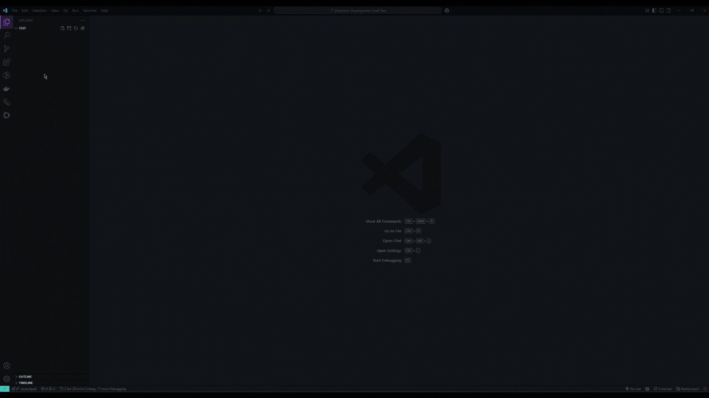

<h1>README Generator</h1>

Easily create a README file easily without any fuss

<br>

<div align="center">
  
</div>

<br>

## Features

- Includes one template based on this [article](https://blog.rocketseat.com.br/como-fazer-um-bom-readme);
- Support En and pt-BR languages;
- Generates title and badges by reading the name of the project on the package.json or the root folder;
- Generates a link to your Github profile;

## Settings

You can add these settings in your settings.json

```js
 "readme.generator.settings.github": "YOUR GITHUB USERNAME"

 "readme.generator.settings.name": "YOUR GITHUB NAME"

 "readme.generator.settings.lang": "THE TEMPLATE LANGUAGE" // Default en

 "readme.generator.settings.templateType": "TYPE OF TEMPLATE" // Default default

 "readme.generator.settings.customTemplatePath": "PATH TO CUSTOM TEMPLATE" // Only used if templateType is "Custom"
```

<br>

* `readme.generator.settings.github`: To add links for you Github profile and to get your repository badges;
* `readme.generator.settings.name`: To put your name on the file end;
* `readme.generator.settings.lang`: The template language;
* `readme.generator.settings.templateType`: Type of template to use either default, full, and custom;
* `readme.generator.settings.customTemplatePath`: Either local path or remote path to be used if templateType is custom;

## Template

- App gif/image;
- Title;
- Badges;
- Status;
- Menu content;

- sections
  - About your project;
  - Features;
  - Technologies;
  - Requirements;
  - Starting;
  - License;

To see the markdown template, [click here](./templates/en/default.md);
